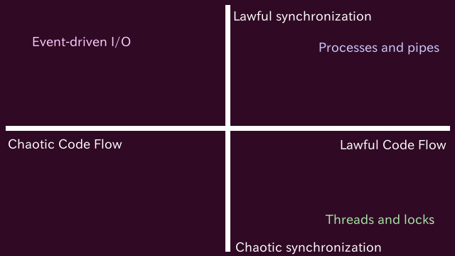

# Handling mails on a text editor

RubyKaigi  2017-09-18


Shugo Maeda

Network Applied Communication Laboratory Ltd.

## Self introduction

* Shugo Maeda
* Ruby committer
* Director at Network Applied Communication Laboratory Ltd.
* Secretary General at Ruby Association

## From Ruby City MATSUE


## Topics

* A text editor written in Ruby
* A message user agent on the text editor
* Law, Chaos, and Cosmic Balance

## Textbringer

* A text editor written in Ruby
* https://github.com/shugo/textbringer
* What you are watching now

## Features of Textbringer

* Emacs like
* Works on terminals
    * Doesn't work without terminals
* Pure Ruby
* Cool name

## The origin of the name

* Stormbringer


## Elric Saga

* Stories written by Michael Moorcock
* Elric
    * 428th Emperor of Melniboné
    * Born with albinism
    * Ruby Throne
* Stormbringer
    * Black sword consuming souls

## Law, Chaos, and Cosmic Balance

* Law
    * Order, Discipline
    * Too lawful => Stagnation
* Chaos
    * Diversity, Change
    * Too chaotic => Destruction
* Cosmic Balance
    * Force for neutrality

## Cosmic Balance


## Programming and Cosmic Balance

* Too chaotic
    * Spaghetti code
    * No test
        * -> Destruction
* Too lawful
    * Mindless use of rubocop
    * Meaningless tests just for coverage
        * -> Stagnation
* We need balance    

## Install Textbringer

    $ gem install textbringer

## Start Textbringer

    $ textbringer

## Exit Textbringer

* Ctrl+X Ctrl+C
* Same as Emacs

## Demo

## Help commands

* Command
    * F1 f <command name>
* Key
    * F1 k <keys...>
* Key bindings
    * F1 b

## Why Ruby?

* Rich features for text processing
* Dynamic nature
* Fun

## Implementation details

* Buffers
* Redisplay
* Extensions

## Buffers

* Data structure for text to be edited
* Attributes
    * Contents
    * Point
    * Marks

## Buffer objects

```ruby
buffer = Buffer.current
buffer.insert("Hello world\n")
buffer.re_search_backward(/world/)
buffer.replace_match("Tochigi")
```

## Implementation methods

* Linked Line
    * Example: vi
* Buffer Gap
    * Example: Emacs
* ref. The Craft of Text Editing
    * https://www.finseth.com/craft/

## Linked Line

* Doubly linked list of lines
* New lines are inserted at the appropriate place

## Buffer Gap

* Sequence of characters with a gap

      0 1 2 3 4 5 6 7 8           9 10
      ---------------------------------
      |h|e|l|l|o| |w|o| | | | | |r|l|d|
      ---------------------------------

* The gap is moved to the point before insertion
* No gap motion is necessary when inserting characters sequentially
* Variations
    * Paged Buffer Gap
    * Additional gap at the end of buffers

## Chosen method

* Buffer Gap by the class String
* Why?
    * Use fast methods of the built-in class
    * Easy to implement multi-line search
    * Need less objects

## Pure Ruby?

* Built-in classes are written in C
* Commiters are working hard on them
* Faster than my own Ruby code

## Internal encoding

* US-ASCII
    * I want to write Japanese!
* UTF-32LE/BE
    * Not supported as source encoding
* UTF-8
    * Chosen

## Pros of UTF-8

* Many characters
    * 𩸽 / 远东多线鱼 / 이면수어
* Easy to step forward and backward
* Easy to write extension code
    * default source encoding
    * many libraries support UTF-8

## Cons of UTF-8

* Character indexing is O(n)
    * Sequential scan is required

## Solution

* UTF-8 byte sequence in ASCII-8BIT
* Use byte indexing
* force_encoding("UTF-8") when necessary

## Is String appropriate to buffers?

* Not optimized for random access
* But better than data structures written in Ruby
* Array suggested by mame san, but
    * pack("U*") is slower than force_encoding("UTF-8")

## Redisplay

* No need to redisplay the whole screen
* But it's bother to implement partial redisplay
* So, use curses

## curses

* Terminal control library
* curses.gem for Ruby
    * I'm the author
    * Was a standard library, but removed
* Curses::Window#erase and Curses.doupdate
    * Redisplay the screen efficiently

## Pure Ruby?

* If it depends on curses, it's not pure Ruby!


## Extension

* The dynamic nature of Ruby

## Evaluation of Ruby code

* eval_expression
* eval_buffer
* eval_region

## eval_expression

* Read code from the minibuffer
* Evaluate it
* Display the result in the echo area

## eval_buffer

* Evaluate the contents of the current buffer

## eval_region

* Evaluate the selected region

## Suppress warnings

```ruby
$VERBOSE = nil
```

## Command definition

```ruby
define_command(:fizzbuzz,
               doc: "Do FizzBuzz from 1 to n.") do
 |n = number_prefix_arg|
  (1..n).each do |i|
    insert ["Fizz"][i%3]
    insert ["Buzz"][i%5]
    insert i if beginning_of_line?
    newline
  end
end
fizzbuzz(15) # method call
```

## Why not `def`?

* Documentation by the doc: option
* Definable anywhere

## Keymap definition

```ruby
GLOBAL_MAP.define_key("\C-xf", :fizzbuzz)
```

## Mode definition

```ruby
class ProgrammingMode < FundamentalMode
  define_generic_command :indent_line

  PROGRAMMING_MODE_MAP = Keymap.new
  PROGRAMMING_MODE_MAP.define_key("\t", :indent_line_command)

  def initialize(buffer)
    super(buffer)
    buffer.keymap = PROGRAMMING_MODE_MAP
  end
```

## Plugins

* Installable as a gem
    * `gem install textbringer-presentation`
    * lib/textbringer_plugin.rb is loaded automaticaly on startup
* Or put in ~/.textbringer/plugins

## Mournmail

* A message user agent
* https://github.com/shugo/mournmail

## Features of Mournmail

* Works on Textbringer
    * Doesn't work without Textbringer
* Supports IMAP, SMTP, and MIME
* Cool name

## The origin of the name

* Mournblade
    * The twin of Stormbringer

## Why Textbringer?

* I wanna edit mails on my text editor
* Fun

## MUAs for Emacs

* Mew
* Wanderlust
* cmail
    * chain mail
* morq
    * Search oriented
    * Backend is written in Ruby
* cmail and morq are written by Matz

## Install Mournmail

    $ gem install mournmail

## Configuration

```ruby
CONFIG[:mournmail_from] = "Elric of Melniboné <elric@melnibone.net>"
CONFIG[:mournmail_charset] = "ISO-2022-JP"
CONFIG[:mournmail_delivery_method] = :smtp
CONFIG[:mournmail_delivery_options] = {
  :address => "smtp.example.com",
  :port => 465,
  :domain => Socket.gethostname,
  :user_name => "elric",
  :password => File.read("/path/to/smtp_passwd").chomp,
  :authentication => "login",
  :tls => true,
  :ca_file => "/path/to/cacert.pem"
}
CONFIG[:mournmail_imap_host] = "imap.example.com"
CONFIG[:mournmail_imap_options] = {
  ssl: {
    :ca_file => File.expand_path("/path/to/cacert.pem")
  },
  auth_type: "PLAIN",
  user_name: "elric",
  password: File.read("/path/to/imap_passwd").chomp
}
```

## Demo

## Background tasks

* Some tasks take a long time
    * Fetching the summary of a mailbox, messages etc.
* Textbringer needs APIs for background tasks

## Implementation methods



## Problems

* Processes and pipes
    * Heavy
* Threads and locks
    * Too hard
* Event-driven I/O
    * Callback hell

## Chosen method

* Dedicated thread for UI

## Dedicated thread for UI

* Most GUI systems have a dedicated thread for servicing user interactions
* That is, code for user interactions is single threaded
    * No locks

## Starting background threads

```ruby
background do
  # Executed in a new thread
end
```

## Limitation in background threads

* Textbringer APIs should not be called
    * Not only editor commands, but also Textbringer::Buffer etc.
    * What happens if they are called?
        * I don't know

## Executing blocks in the UI thread

```ruby
background do
  # Do something for a long time
  next_tick do
    # Executed in the UI thread
  end
  # next_tick returns immediately
end
```

## Waiting block execution

```ruby
background do
  # Do something for a long time
  next_tick! do
    # Executed in the UI thread
  end
  # next_tick! returns after the block is executed
end
```

## Implementation of next_tick

```ruby
def next_tick(&block)
  @next_tick_queue_mutex.synchronize do
    @next_tick_queue.push(block)
  end
  @next_tick_output.write("\n")
end

def read_event
  ...
  files, = IO.select([STDIN, @next_tick_input], [], [], 1)
```

## Libraries to handle mails

* mail.gem
    * Library to handle mails
    * Mail generation, sending, receiving, and parsing

* Net::IMAP
    * IMAP client library
    * I'm the author
    * Bundled with Ruby

## Syncing summary

```ruby
define_command(:mournmail_summary_sync, doc: "Sync summary.") do
  |mailbox = (Mournmail.current_mailbox || "INBOX"),
    all = current_prefix_arg|
  message("Syncing #{mailbox} in background...")
  Mournmail.background do
    summary = Mournmail.fetch_summary(mailbox, all: all)
    summary_text = summary.to_s
    summary.save
    next_tick do
      buffer = Buffer.find_or_new("*summary*", undo_limit: 0,
                                  read_only: true)
      buffer.apply_mode(Mournmail::SummaryMode)
      buffer.read_only_edit do
        buffer.clear
        buffer.insert(summary_text)
      end
      switch_to_buffer(buffer)
      Mournmail.current_mailbox = mailbox
      Mournmail.current_summary = summary
      Mournmail.current_mail = nil
      Mournmail.current_uid = nil
      message("Syncing #{mailbox} in background... Done")
      begin
        buffer.beginning_of_buffer
        buffer.re_search_forward(/^\d+ u/)
      rescue SearchError
        buffer.end_of_buffer
        buffer.re_search_backward(/^\d+ /, raise_error: false)
      end
      summary_read_command
    end
  end
end
```

## Fetching summary

```ruby
  def self.fetch_summary(mailbox, all: false)
    imap_connect do |imap|
      imap.select(mailbox)
      if all
        summary = Mournmail::Summary.new(mailbox)
      else
        summary = Mournmail::Summary.load_or_new(mailbox)
      end
      first_uid = (summary.last_uid || 0) + 1
      data = imap.uid_fetch(first_uid..-1, ["UID", "ENVELOPE", "FLAGS"])
      summary.synchronize do
        data&.each do |i|
          uid = i.attr["UID"]
          next if summary[uid]
          env = i.attr["ENVELOPE"]
          flags = i.attr["FLAGS"]
          item = Mournmail::SummaryItem.new(uid, env.date, env.from,
                                            env.subject, flags)
          summary.add_item(item, env.message_id, env.in_reply_to)
        end
      end
      summary
    end
  end
```

## Reading mails

```ruby
module Mournmail
  class SummaryMode < Textbringer::Mode
    define_local_command(:summary_read, doc: "Read a mail.") do
      uid = scroll_up_or_next_uid
      return if uid.nil?
      Mournmail.background do
        mailbox = Mournmail.current_mailbox
        mail = Mail.new(Mournmail.read_mail(mailbox, uid))
        message = mail.render
        next_tick do
          message_buffer = Buffer.find_or_new("*message*",
                                              undo_limit: 0, read_only: true)
          message_buffer.apply_mode(Mournmail::MessageMode)
          message_buffer.read_only_edit do
            message_buffer.clear
            message_buffer.insert(message)
            message_buffer.beginning_of_buffer
          end
          window = Mournmail.message_window
          window.buffer = message_buffer
          mark_as_seen(uid)
          Mournmail.current_uid = uid
          Mournmail.current_mail = mail
        end
      end
    end
```

## Rendering MIME messages

```ruby
module Mournmail
  module MessageRendering
    refine ::Mail::Message do
      def render(indices = [])
        render_header + "\n" + render_body(indices)
      end

      def render_header
        CONFIG[:mournmail_display_header_fields].map { |name|
          val = self[name]
          val ? "#{name}: #{val}\n" : ""
        }.join
      end        

      def render_body(indices = [])
        if HAVE_MAIL_GPG && encrypted?
          mail = decrypt(verify: true)
          return mail.render_body(indices)
        end
        if multipart?
          parts.each_with_index.map { |part, i|
            part.render([*indices, i])
          }.join
        else
          s = body.decoded
          if /\Autf-8\z/i =~ charset
            s.force_encoding(Encoding::UTF_8).scrub("?")
          else
            s.encode(Encoding::UTF_8, charset, replace: "?")
          end.gsub(/\r\n/, "\n")
        end + pgp_signature
      end

      def dig_part(i, *rest_indices)
        if HAVE_MAIL_GPG && encrypted?
          mail = decrypt(verify: true)
          return mail.dig_part(i, *rest_indices)
        end
        part = parts[i]
        if rest_indices.empty?
          part
        else
          part.dig_part(*rest_indices)
        end
      end

      private

      def pgp_signature 
        if HAVE_MAIL_GPG && signed?
          verified = verify
          validity = verified.signature_valid? ? "Good" : "Bad"
          from = verified.signatures.map { |sig|
            sig.from rescue sig.fingerprint
          }.join(", ")
          "#{validity} signature from #{from}\n"
        else
          ""
        end
      end
    end

    refine ::Mail::Part do
      def render(indices)
        index = indices.join(".")
        type = Mail::Encodings.decode_encode(self["content-type"].to_s,
                                             :decode)
        "[#{index} #{type}]\n" + render_content(indices)
      end

      def dig_part(i, *rest_indices)
        if main_type == "message" && sub_type == "rfc822"
          mail = Mail.new(body.raw_source)
          mail.dig_part(i, *rest_indices)
        else
          part = parts[i]
          if rest_indices.empty?
            part
          else
            part.dig_part(*rest_indices)
          end
        end
      end

      private

      def render_content(indices)
        if multipart?
          parts.each_with_index.map { |part, i|
            part.render([*indices, i])
          }.join
        elsif main_type == "message" && sub_type == "rfc822"
          mail = Mail.new(body.raw_source)
          mail.render(indices)
        elsif self["content-disposition"]&.disposition_type == "attachment"
          ""
        else
          if main_type == "text" && sub_type == "plain"
            decoded.sub(/(?<!\n)\z/, "\n").gsub(/\r\n/, "\n")
          else
            ""
          end
        end
      end
    end
  end
end
```

## Refinements

* Local monkey patching
* I'm the proposer
* Useful to traverse recursive data structures

## Sending mails

```ruby
module Mournmail
  class DraftMode < Textbringer::Mode
    define_local_command(:draft_send,
                         doc: "Send a mail and exit from mail buffer.") do
      unless y_or_n?("Send this mail?")
        return
      end
      s = @buffer.to_s
      charset = CONFIG[:mournmail_charset]
      begin
        s.encode(charset)
      rescue Encoding::UndefinedConversionError
        charset = "utf-8"
      end
      m = Mail.new(charset: charset)
      header, body = s.split(/^--text follows this line--\n/, 2)
      attached_files = []
      attached_messages = []
      header.scan(/^([!-9;-~]+):[ \t]*(.*(?:\n[ \t].*)*)\n/) do |name, val|
        case name
        when "Attached-File"
          attached_files.push(val.strip)
        when "Attached-Message"
          attached_messages.push(val.strip)
        else
          m[name] = val
        end
      end
      if body.empty?
        return if !yes_or_no?("Body is empty.  Really send?")
      else
        if attached_files.empty? && attached_messages.empty?
          m.body = body
        else
          part = Mail::Part.new(content_type: "text/plain", body: body)
          part.charset = charset
          m.body << part
        end
      end
      attached_files.each do |file|
        m.add_file(file)
      end
      m.delivery_method(CONFIG[:mournmail_delivery_method],
                        CONFIG[:mournmail_delivery_options])
      bury_buffer(@buffer)
      background do
        begin
          if !attached_messages.empty?
            attached_messages.each do |attached_message|
              mailbox, uid = attached_message.strip.split("/")
              s = Mournmail.read_mail(mailbox, uid.to_i)
              part = Mail::Part.new(content_type: "message/rfc822", body: s)
              m.body << part
            end
          end
          m.deliver!
          Mournmail.imap_connect do |imap|
            outbox = CONFIG[:mournmail_outbox]
            if outbox
              imap.append(outbox, m.to_s, [:Seen])
            end
          end
          next_tick do
            kill_buffer(@buffer, force: true)
            Mournmail.back_to_summary
            message("Mail sent.")
          end
        rescue Exception
          next_tick do
            switch_to_buffer(@buffer)
          end
          raise
        end
      end
    end
```

## Conclusion

* It's fun to write a text editor and its plugins
* Because Ruby has power to extend a text editor at runtime
    * eval
        * Matz's most (and least) favorite method
    * Open classes
* I hope static typing of Ruby 3 will not spoil it
* Keep Cosmic Balance!

## Thank you!

* https://github.com/shugo/RubyKaigi2017


